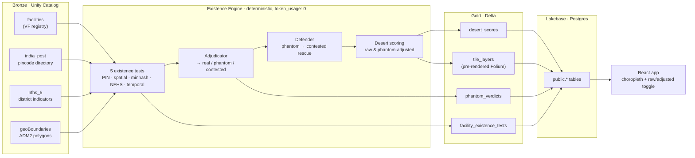

# `data/` — input fixtures for the Phantom Census pipeline

The repo ships only the spatial layer (`geoBoundaries-IND-ADM2.geojson`,
~48 MB). The four operational inputs are pulled manually before the demo
runs; they are not redistributed here.

## Data flow

How these inputs move from bronze through the deterministic engine to the app:



## Required files

| Path (place under `data/`) | Source | Used by |
|---|---|---|
| `vf.parquet` | Databricks Unity Catalog: `databricks_virtue_foundation_dataset_dais_2026.virtue_foundation_dataset` | Engine (`--facilities`) |
| `india_post.csv` | Catalog: `…india_post_pincode_directory` | Engine (`--india-post`); also feeds the auto-built district→state map |
| `nfhs5_district.csv` | Catalog: `…nfhs_5_district_health_indicators` | Engine (`--nfhs`); desert-scoring (`--nfhs`) |
| `hfr_snapshot.csv` *(optional)* | ABDM Health Facility Registry snapshot — when absent, the Defender's HFR-match rescue is a no-op | Engine (`--hfr`) |
| `geoBoundaries-IND-ADM2.geojson` ✅ already on disk | https://www.geoboundaries.org/ ADM2 India (735 polygons) | Engine (`--districts`); desert-scoring (`--districts`) |

Pull the three Catalog tables with the Databricks CLI:

```bash
databricks fs cp dbfs:/.../virtue_foundation_dataset.parquet data/vf.parquet
databricks fs cp dbfs:/.../india_post_pincode_directory.csv data/india_post.csv
databricks fs cp dbfs:/.../nfhs_5_district_health_indicators.csv data/nfhs5_district.csv
```

Real column names vary across exports; the engine + desert-scoring loaders
already normalize `State Name`, `STATE`, `district`, `Pincode`, `Latitude`,
etc. (see `phantom_census/desert_scoring/batch.normalize_nfhs_columns` and
`phantom_census/existence_engine/data_loading.load_india_post`).

## Provision Postgres / Lakebase

The Lakebase + desert-scoring CLIs and the Streamlit app all read
`LAKEBASE_URL`. There is no SQLite fallback (Postgres-only by design).

```bash
# Local dev (Postgres in Docker):
docker run -d --name pc-pg -e POSTGRES_PASSWORD=pc -p 5432:5432 postgres:16-alpine
export LAKEBASE_URL='postgresql+psycopg://postgres:pc@localhost:5432/postgres'

# Databricks Lakebase:
export LAKEBASE_URL='postgresql+psycopg://<user>:<token>@<host>:5432/<db>'
```

## Full demo run

```bash
# 1. Schema
python -m phantom_census.lakebase init

# 2. Engine batch → ./out/engine/{facility_existence_tests.parquet,
#    phantom_verdicts.parquet, claim_minhash.parquet,
#    facility_district_xref.csv}
python -m phantom_census.existence_engine \
  --facilities  data/vf.parquet \
  --india-post  data/india_post.csv \
  --nfhs        data/nfhs5_district.csv \
  --districts   data/geoBoundaries-IND-ADM2.geojson \
  --hfr         data/hfr_snapshot.csv \
  --out         out/engine

# 3. Load to Lakebase (auto-picks up facility_district_xref.csv from out/engine/)
python -m phantom_census.lakebase load --from out/engine

# 4. Score + pre-render tiles for the demo state
python -m phantom_census.desert_scoring \
  --districts   data/geoBoundaries-IND-ADM2.geojson \
  --nfhs        data/nfhs5_district.csv \
  --capability  maternity \
  --state       Maharashtra

# 5. Launch UI
streamlit run app.py
```

The HLD success metric "**BEED rank 10 → 2**" lands in the "Top movers"
panel under the choropleth on first render.

## Day-0 validation

The validation suite under `phantom_census_validation.md` walks the data
preconditions kill-switch by kill-switch (geocoding rate, PIN-vs-GPS
disagreement, demo-state phantom yield). Run it before the engine batch on
each fresh data pull — if both kill-switches stay GREEN the demo's
"304 phantoms / 33 districts / BEED 10→2" promise is still meetable.
